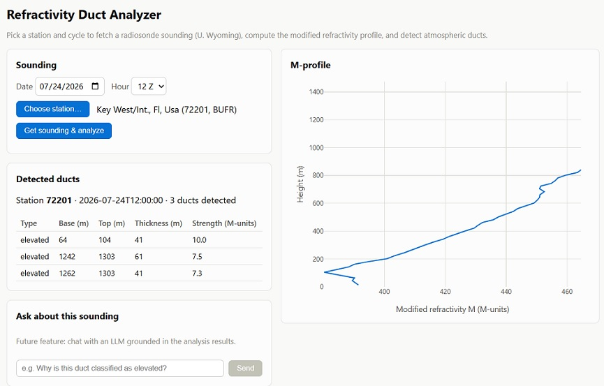

# DuctScan

**Atmospheric ducting analysis from radiosonde and model data.**

DuctScan ingests public atmospheric soundings, computes the modified refractivity (M)
profile from first principles, and detects the trapping layers ("ducts") that cause
anomalous radio-frequency propagation. It pairs a deterministic physics core with an
interactive web UI and an AI assistant that explains results in plain language, grounded
in an authoritative document corpus.



---

## What it does

Radio and radar signals normally travel in near-straight lines. But when modified
refractivity **decreases** with height (`dM/dz < 0`), a layer of the atmosphere can trap
signals and carry them far beyond the normal horizon — a *duct*. Ducts matter for radar
performance, communications range, and detecting over-the-horizon effects.

DuctScan detects and characterizes these ducts:

- **Fetches real data**: pulls radiosonde soundings from the University of Wyoming
  upper-air archive by station and time.
- **Computes the physics**: derives refractivity (N) and modified refractivity (M) from
  pressure, temperature, and moisture at each level.
- **Detects ducts**: finds trapping layers from the vertical M-gradient, classifies them
  as surface or elevated, and measures each one's height, thickness, and strength (ΔM).
- **Visualizes**: renders the M-profile and highlights trapping layers in an interactive
  React interface with an OpenLayers station-selection map.
- **Explains**: an AI assistant answers questions about the analyzed sounding and about
  ducting/propagation in general, grounded via Retrieval-Augmented Generation (RAG) in a
  corpus of authoritative reference documents.

All data used is public. DuctScan is an independent project and uses no proprietary or
restricted data sources.

---

## Architecture

```
┌─────────────────┐     ┌──────────────────────┐      ┌─────────────────┐
│  React + TS     │────▶│  FastAPI (Python)    │────▶│   LLM provider  │
│  frontend       │     │                      │      │                 │
│  - OpenLayers   │     │  - Wyoming ingest    │      └─────────────────┘
│    station map  │◀────│  - refractivity / M  │◀───────────┐
│  - M-profile    │     │  - duct detection    │      ┌─────────────────┐
│  - chat panel   │     │  - RAG retrieval     │────▶│  Supabase        │
└─────────────────┘     └──────────────────────┘      │  pgvector       │
                                                      └─────────────────┘
```

**Backend** — Python / FastAPI. Ingests Wyoming CSV soundings, cleans and height-bins the
high-cadence data, computes the M-profile, and runs duct detection. Exposes REST endpoints
for analysis and for the AI assistant.

**Frontend** — React / TypeScript. An OpenLayers map lets you pick a station; the results
view plots the M-profile with trapping layers shaded and lists the detected ducts.

**AI layer** — an LLM behind a provider abstraction. Domain documents are embedded with Voyage AI and stored in
Supabase pgvector; user questions retrieve relevant passages and are answered with
source-cited, grounded responses.

---

## Tech stack

| Layer | Tools |
|---|---|
| Backend | Python, FastAPI, numpy, xarray |
| Data | University of Wyoming radiosonde archive (BUFR/CSV) |
| Frontend | React, TypeScript, OpenLayers |
| AI / RAG | LLM API (provider-abstracted), Voyage AI embeddings, Supabase pgvector |
| Infra | Docker, GitHub Actions (CI/CD) |

---

## The science, briefly

Modified refractivity folds Earth curvature into the refractivity so that ducts appear as
simple slope reversals:

```
N = 77.6 · P/T + 3.73e5 · e/T²        (P hPa, T K, e = vapor pressure hPa)
M = N + 0.157 · h                     (h in meters)
```

- **M increasing with height** → normal propagation.
- **M decreasing with height** (`dM/dz < 0`) → a trapping layer / duct.

Duct **strength** is the drop in M across the trapping layer (ΔM = M at the base − M at the
top). A minimum-strength threshold filters out gradient noise so only meaningful ducts are
reported. High-cadence sounding data is height-binned before analysis to suppress spurious
detections from sensor noise.


## Roadmap

- [ ] Regional grid scanning (GFS) with a ducting heatmap across an area
- [ ] AWS deployment (ECS / Lambda) with CI/CD
- [ ] Additional data sources (gridded model output)

---

## Notes

DuctScan is a personal project built to explore the intersection of atmospheric science,
scientific-data engineering, and modern full-stack + AI development. It runs entirely on
publicly available data.